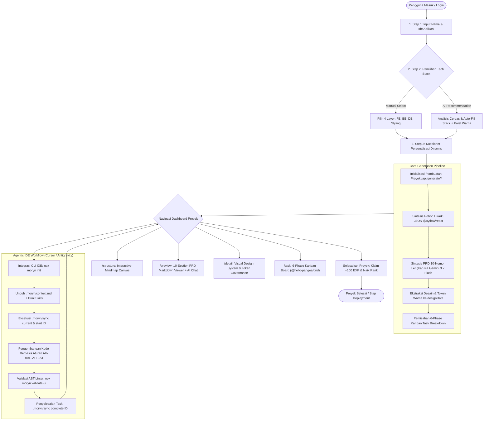
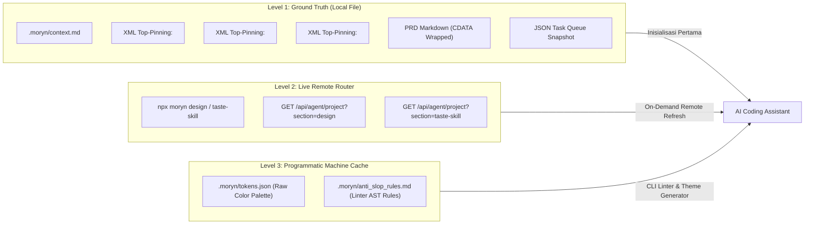
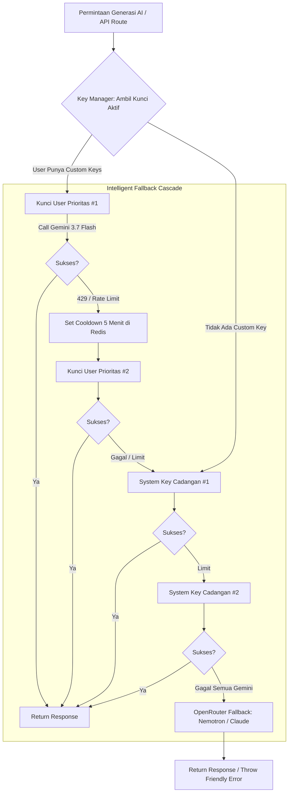
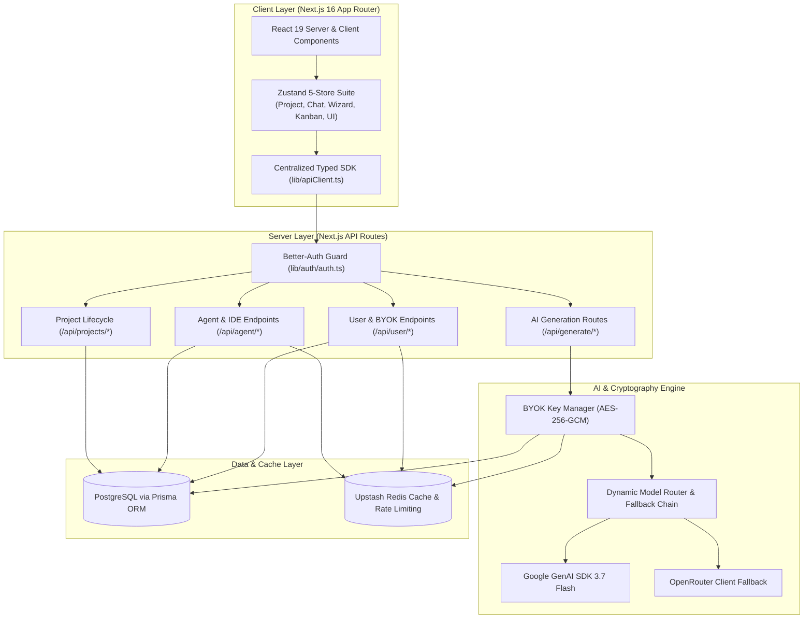
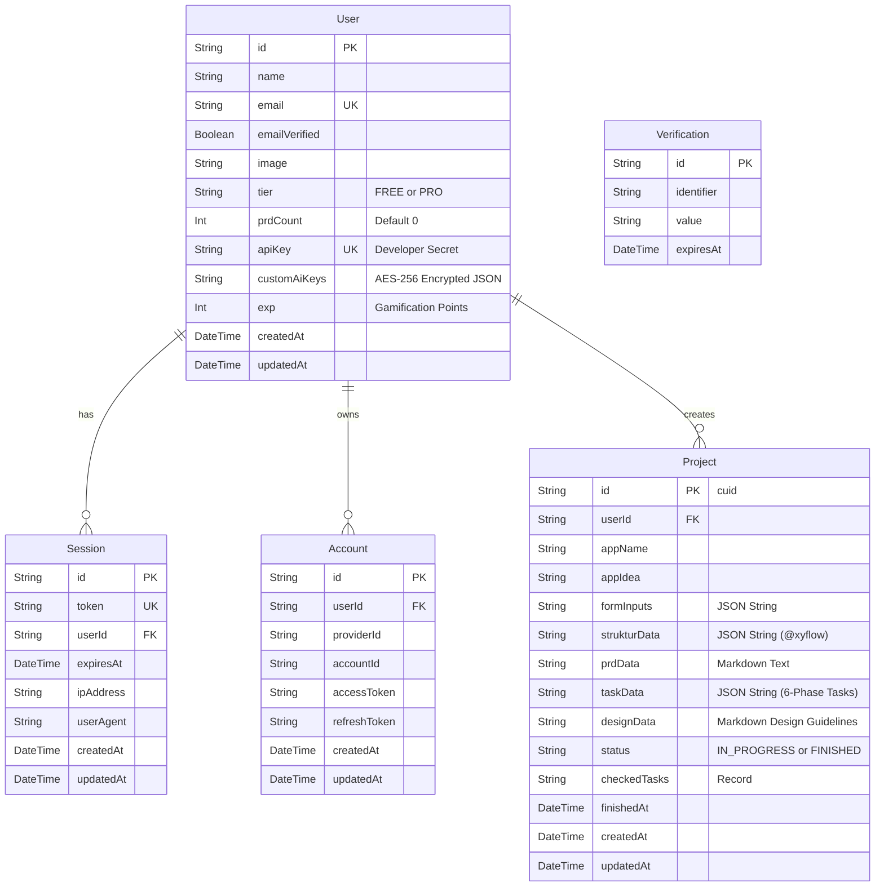

# PRODUCT REQUIREMENTS DOCUMENT (PRD)

# Piardify / Moryn — AI PRD Architect & System Architecture Tracking Platform

**Versi**: v2.14.0  
**Tanggal Efektif**: 24 Agustus 2026  
**Status**: Active / Production-Ready  
**Klasifikasi Dokumen**: Official System Blueprint & Product Specification  
**Author**: Engineering & Product Architecture Team  

---

## 1. Executive Summary & Core Objectives

### 1.1 Product Summary
**Piardify** (berevolusi dan beroperasi di bawah brand arsitektur **Moryn**) adalah platform rekayasa perangkat lunak otonom berbasis AI (*Autonomous Software Engineering Platform*) yang mengubah ide produk mentah menjadi **Product Requirements Document (PRD)** terstruktur 10-nomor, **Visual Architecture Tree** interaktif (*React Flow Canvas*), **Visual Design System & Token Governance**, serta **6-Phase Modular Kanban Tasks** yang terintegrasi secara langsung dengan AI Coding Assistants (seperti Antigravity, Cursor, Windsurf, Claude Code) melalui **NPX CLI** dan **Protokol Eksekusi Agentik 10ms**.

Platform ini menyelesaikan kesenjangan terbesar dalam software engineering modern: **halusinasi arsitektur oleh AI generik** dan **kehilangan konteks teknis** saat beralih dari spesifikasi produk ke implementasi baris kode di IDE.

---

### 1.2 Core Problem & The Piardify Solution

```
┌─────────────────────────────────────────────────────────────┐
│                    TRADITIONAL WORKFLOW                     │
│  Ide Mentah ──> Chat AI Generik ──> Halusinasi Arsitektur   │
│  (Token boros, stack acak, file missing, 0 design tokens)   │
└─────────────────────────────────────────────────────────────┘
                              ▼
┌─────────────────────────────────────────────────────────────┐
│                 PIARDIFY / MORYN WORKFLOW                   │
│  Ide ──> 3-Step Wizard ──> 10-Section PRD ──> Visual Tree   │
│  ──> Design Tokens ──> 6-Phase Kanban ──> NPX CLI Sync      │
│  (Zero-Invention, Zero-Slop, 10ms Realtime Kanban Sync)     │
└─────────────────────────────────────────────────────────────┘
```

* **Masalah Utama**:
  1. *Architectural Hallucination*: AI generik sering mengasumsikan database schema, mengarang API response shape, dan mengimpor pustaka usang yang merusak build pipeline.
  2. *Token Redundancy & Context Window Bloat*: Dokumen teknis yang terlalu panjang (>1000 baris) menyebabkan context truncation dan degradasi penalaran LLM.
  3. *AI Slop Visual Aesthetics*: Kode antarmuka yang digenerate AI sering menggunakan palet warna generik (`#0F172A`, `#000000`), headline gradasi ungu berlebihan, tumpukan card bersarang >2 level, dan viewport bug (`h-screen`).
  4. *Desinkronisasi State*: Perubahan pada PRD tidak otomatis tersinkronisasi ke daftar task pengembang dan kode aktual.

* **Solusi Terintegrasi Piardify**:
  - **Pipeline 4 Tahap Terikat**: Wizard Personalisasi $\rightarrow$ 10-Section PRD $\rightarrow$ Visual Architecture Tree $\rightarrow$ 6-Phase Kanban Task Breakdown.
  - **Tri-Combo Zero-Redundancy Context Engine**: Memangkas konsumsi token hingga 65%–84% melalui XML Top-Pinning (`<critical_design_locks>`, `<layout_governance>`), CDATA Markdown, dan active task windowing.
  - **AST Anti-Slop Linter Engine (`validate-ui`)**: Penganalisis kode statis berbasis AST yang memblokir 9 pola visual klise langsung di terminal dan CI/CD gate.
  - **Custom Multi-API Key Pool (BYOK)**: Multi-key fallback cascade dengan enkripsi AES-256-GCM, auto rate-limit cooldown (5 menit di Upstash Redis), dan unlimited quota bypass.
  - **Ekosistem NPX CLI 12-Perintah**: Mengotentikasi, menarik cetak biru terpadu (`.moryn/context.md`), dan menyinkronkan status task Kanban dalam latensi <10ms.

---

### 1.3 Target Users & Personas

| Persona | Karakteristik & Kebutuhan | Manfaat Utama dari Piardify |
| :--- | :--- | :--- |
| **Software Engineer / Solo Developer** | Memerlukan arsitektur teknis yang kokoh sebelum koding; membutuhkan pembagian task atomik yang langsung terbaca oleh Cursor/Antigravity. | Blueprint teknis siap pakai, auto-scaffolding folder, dan sinkronisasi task Kanban 10ms via CLI tanpa keluar dari terminal IDE. |
| **Indie Hacker & Startup Founder** | Mengembangkan MVP dari ide bisnis abstrak dalam waktu singkat; memerlukan estimasi stack dan UI anti-slop yang kredibel di mata investor. | AI Stack Recommender instan, generator PRD dalam <3 menit, serta panduan desain berstandar agensi premium. |
| **Product Manager & Tech Lead** | Menyusun dokumentasi spesifikasi produk formal, mengontrol scope creep, dan memelihara kepatuhan arsitektur tim. | Standarisasi 10-Nomor PRD, visual mindmap yang dapat diekspor, pelacakan dependensi, dan verifikasi kriteria penyelesaian (DoD). |
| **Mahasiswa / Akademisi IT** | Membutuhkan dokumentasi tugas akhir/capstone project dengan metodologi rekayasa perangkat lunak formal. | Template PRD komprehensif, pemetaan entity-relationship diagram (ERD) Mermaid, dan panduan best-practice industri. |

---

### 1.4 Primary Goals & Key Performance Indicators (KPIs)

* **Kecepatan Generasi**: $\ge 90\%$ PRD dan arsitektur produk selesai disintesis dalam waktu $< 3$ menit per proyek.
* **Akurasi Arsitektur Tanpa Halusinasi**: $\ge 95\%$ konsistensi konteks antara PRD, struktur pohon diagram visual, dan kartu task Kanban.
* **Efisiensi Token Konteks**: Penghematan token sebesar $65\% \text{ s/d } 84\%$ pada context serialization berkat sistem *Lossless Context Densification* dan *Lazy-Loaded Skills*.
* **Latensi Sinkronisasi Task**: Sinkronisasi status task dari terminal pengembang (`.moryn/sync start` / `complete`) ke dashboard web browser selesai dalam waktu $\le 10\text{ms}$.
* **Kehandalan Build & Linter**: 0% pelanggaran Anti-Slop pada komponen UI yang di-scaffold melalui `npx moryn generate`.

---

## 2. End-to-End User Flow & Lifecycle Architecture

Siklus hidup pengerjaan produk di Piardify dirancang sebagai lingkaran tertutup (*closed-loop lifecycle*):



---

## 3. Functional Requirements & Feature Matrix

Berikut adalah spesifikasi kebutuhan fungsional formal (*Functional Requirements*) platform Piardify/Moryn:

| ID | Modul Fitur | User Story & Deskripsi Teknis | Kriteria Penerimaan (Acceptance Criteria) |
| :--- | :--- | :--- | :--- |
| **FR-01** | **Multi-Step Dynamic Wizard** | Sebagai user, saya ingin mengisi ide produk secara bertahap dengan persistensi draf lokal agar data tidak hilang saat refresh atau navigasi terputus. | Formulir terbagi menjadi 3 langkah (`Step1BasicInfo`, `Step2TechStack`, `Step3Questions`). State tersimpan di `localStorage` via Zustand `persist` middleware (`useWizardStore`). |
| **FR-02** | **AI Tech Stack & Color Auto-Recommend** | Sebagai user, saya ingin AI menganalisis ide produk saya dan merekomendasikan kombinasi stack dan palet warna yang paling optimal dalam satu klik. | Endpoint `POST /api/generate/recommend-stack` mengembalikan rekomendasi 4 pilar stack (Frontend, Backend, Database, Styling) beserta palet tema visual harmonis dalam $< 2$ detik. |
| **FR-03** | **7-Step Contextual Questionnaire** | Sebagai user, saya ingin menjawab pertanyaan terarah yang relevan dengan domain produk saya untuk membasmi halusinasi scope. | AI menghasilkan pertanyaan dinamis sesuai kategori produk (Web, Mobile, IoT, Backend). Jawaban disimpan di `formInputs` dan diikat sebagai konstanta prompt permanen. |
| **FR-04** | **Strict 10-Section PRD Synthesis** | Sebagai user, saya ingin menghasilkan dokumen PRD komprehensif berstandar industri dengan format 10 bab baku. | Model Google Gemini 3.7 Flash menghasilkan Markdown 10-Nomor lengkap dengan Mermaid flowcharts, Acceptance Criteria *Given-When-Then*, ERD diagram, dan kontrak REST API. |
| **FR-05** | **Interactive PRD Viewer & Chat Modifier** | Sebagai user, saya ingin membaca PRD dengan penomoran TOC dinamis dan merevisi bab tertentu via chat asisten AI tanpa merusak bagian lain. | Halaman `/preview` merender Markdown dengan syntax highlighting (Shiki), KaTeX, dan Mermaid parser. AI Chat Engine (`/api/generate/edit-prd`) menggunakan delimiter XML `<updated_prd>` untuk pembaruan inkremental aman. |
| **FR-06** | **Interactive Visual Mindmap Canvas** | Sebagai user, saya ingin melihat dan memanipulasi diagram struktur arsitektur produk dalam bentuk pohon hirarki visual. | Kanvas berbasis `@xyflow/react` menampilkan hirarki 3 level (Root $\rightarrow$ Kategori $\rightarrow$ Leaf). Mendukung penggeseran node, inline-editing judul, penambahan/penghapusan node, dan bidirectional parser Visual-to-JSON instan. |
| **FR-07** | **Design System Extraction & Governance** | Sebagai user, saya ingin sistem mengekstrak aturan visual dan token warna secara terpusat untuk memandu UI developer/agent. | Halaman `/detail` menyajikan tabel token warna HEX, RGB, variabel CSS, aturan tipografi, hirarki radius, pedoman *Dos & Don'ts*, dan dropzone aset template desain. |
| **FR-08** | **6-Phase Modular Kanban Task Breakdown** | Sebagai developer, saya ingin modul arsitektur diurai menjadi daftar kartu task konkret dalam 6 fase standar industri. | Halaman `/task` mengelompokkan task ke 6 fase terstruktur (`Phase 1` s/d `Phase 6`) dengan fitur drag-and-drop `@hello-pangea/dnd`, pelacakan persentase progres, dan filter fase aktif. |
| **FR-09** | **Realtime 10ms Agentic Task Sync** | Sebagai developer, saya ingin AI Coding Assistant memperbarui status task Kanban langsung dari terminal tanpa membuka web browser. | File skrip lokal `.moryn/sync` memproses perintah `start`, `complete`, dan `fail` dengan memanggil `/api/agent/tasks/[id]/*`. Status kartu pada UI browser ter-update seketika dalam latensi $\le 10\text{ms}$. |
| **FR-10** | **Moryn NPX CLI 12-Perintah** | Sebagai developer, saya ingin mengelola seluruh ekosistem proyek secara headless melalui terminal. | Paket CLI `moryn` menyediakan 12 perintah fungsional: `login`, `init`, `project`, `task`, `kanban`, `design`, `validate-ui`, `init-theme`, `generate`, `hook`, `clean`, dan `status`. |
| **FR-11** | **Dual-Skill Auto-Provisioning** | Sebagai developer, saya ingin perintah init otomatis memasang skill agen pengembang dan skill pemikiran desain frontend ke workspace. | Eksekusi `npx moryn init` menyuntikkan `.agents/skills/moryn/SKILL.md` (alur kerja) dan `.agents/skills/frontend/SKILL.md` (prinsip desain anti-slop, metafora visual, & interaction recipes). |
| **FR-12** | **AST Static Analysis Anti-Slop Linter** | Sebagai lead engineer, saya ingin memindai kode frontend secara statis untuk mendeteksi dan memblokir 9 pola visual klise AI. | Perintah `npx moryn validate-ui` memeriksa kode TypeScript/TSX menggunakan parser AST Babel/TypeScript tanpa overhead runtime, menandai pelanggaran kode kritis dan peringatan visual. |
| **FR-13** | **Multi-Archetype Component Generator** | Sebagai developer, saya ingin membuat boilerplate komponen UI Anti-Slop dalam 6 varian pola modular. | Perintah `npx moryn generate <type> <Name>` men-scaffold file TSX mandiri siap pakai untuk tipe `card`, `hero`, `table`, `form`, `modal`, dan `bento`. |
| **FR-14** | **Automated CI/CD Guardrail Hooks** | Sebagai engineer, saya ingin pipeline git commit dan build lokal secara otomatis menggagalkan proses jika terdeteksi AI slop. | Perintah `npx moryn hook` memasang Git Pre-Commit Hook (`.git/hooks/pre-commit`) dan script NPM Pre-Build (`"prebuild": "npx moryn validate-ui"`) pada `package.json`. |
| **FR-15** | **Custom Multi-API Key Pool (BYOK)** | Sebagai user, saya ingin menggunakan API key pribadi (Gemini & OpenRouter) dengan cascade fallback cerdas agar bebas dari batas kuota sistem. | Pengguna dapat mendaftarkan beberapa API key di `/profile`. Kunci dienkripsi AES-256-GCM, otomatis mengalami cooldown 5 menit di Redis jika menerima error 429, dan mem-bypass kuota harian. |
| **FR-16** | **Gamifikasi, Rank EXP, & Pro Export Protection** | Sebagai user, saya ingin memperoleh penghargaan EXP saat menyelesaikan proyek dan mengamankan aset ekspor bagi user Pro. | Penyelesaian proyek memberikan +100 EXP dan meningkatkan lencana Rank (10 tingkat dari *Sprout* hingga *Wrench Master*). Unduhan Markdown mentah dan JSON arsitektur diproteksi khusus pengguna tier `PRO`. |

---

## 4. Arsitektur Konteks 3-Layer & Lossless Densification Engine

Untuk menjamin AI Coding Assistant bekerja tanpa kehilangan memori proyek dan tanpa memboroskan kuota token, Piardify mengimplementasikan **3-Layer Hybrid Context Architecture**:



### 4.1 Hierarki Single Source of Truth (SSOT)
1. **Level 1 (Ground Truth)**: `.moryn/context.md` — Berkas tunggal terpadu yang diletakkan di root proyek pengembang. Menampung XML Design Locks, Layout Governance, teks lengkap PRD 10-Nomor, serta status antrean task aktif.
2. **Level 2 (Live Remote Refresh)**: `npx moryn design` / `npx moryn project taste-skill` — Mengambil data token desain atau spesifikasi taste skill terperinci langsung dari server via remote API secara on-demand saat dibutuhkan untuk refactoring besar.
3. **Level 3 (Programmatic Cache)**: `.moryn/tokens.json` & `.moryn/anti_slop_rules.md` — Berkas cache lokal terstruktur untuk dieksekusi oleh mesin AST Linter dan generator tema CLI.

### 4.2 Prinsip Densifikasi Konteks Lossless (~65% - 84% Token Reduction)
- **Top-of-File XML Tagging**: Mengunci token warna absolut (`#090A0C`, `#121318`, `#181A22`, `#6366F1`), radius proporsional, dan format Rupiah ringkas (`Rp X,XX Jt`) di baris teratas berkas konteks agar LLM menaruh perhatian tertinggi (*attention weight*).
- **Active Task Windowing**: Menghilangkan riwayat ratusan task lama yang telah berstatus `DONE` dari payload aktif, dan hanya menyuntikkan 1 task `IN_PROGRESS` serta 3 task `TODO` berikutnya.
- **Minified Directives Syntax**: Mengompresi 23 aturan anti-halusinasi menjadi format 1-baris padat atribut tanpa membuang makna operasionalnya.

---

## 5. Moryn CLI v2.14.0 Suite & AST Anti-Slop Linter

### 5.1 Rincian 12 Perintah Resmi Moryn CLI

```bash
# Otentikasi Developer
npx moryn login --token <DEVELOPER_API_KEY>

# Inisialisasi Workspace & Download Dual Skills
npx moryn init [--project <ID>] [--target web|mobile|iot|backend]

# Inspeksi Status Koneksi & Konfigurasi
npx moryn status

# Pengambilan Konteks Desain & Token Warna Live
npx moryn design

# Menampilkan Papan Kanban Interaktif di Terminal
npx moryn kanban

# Manajemen Task Terperinci
npx moryn task list
npx moryn task current
npx moryn task start <TASK_ID>
npx moryn task complete <TASK_ID>

# Pemindaian AST Anti-Slop Linter
npx moryn validate-ui [--strict]

# Scaffolding Komponen UI Anti-Slop
npx moryn generate <card|hero|table|form|modal|bento> <ComponentName>

# Inisialisasi Preset Tailwind & CSS Variables
npx moryn init-theme [--format css|tailwind]

# Pemasangan Otomatis Git Pre-Commit Hook & NPM Pre-Build
npx moryn hook

# Pembersihan Kode Sampah & Orphaned Components
npx moryn clean

# Pengambilan Spesifikasi Taste Skill Terpisah
npx moryn project taste-skill
```

---

### 5.2 9 Pelanggaran Visual AST Anti-Slop Linter Engine

Mesin `npx moryn validate-ui` menganalisis berkas TypeScript/TSX menggunakan parser AST untuk mendeteksi:

```
┌─────────────────────────── AST ANTI-SLOP LINTER MATRIX ───────────────────────────┐
│ Kode Pelanggaran            │ Tingkat   │ Kriteria & Konsekuensi                          │
├─────────────────────────────┼───────────┼─────────────────────────────────────────────────┤
│ GRADIENT_HEADLINE           │ ERROR     │ Gradasi teks warna-warni pada kata kunci        │
│ OVER_NESTED_CARDS           │ ERROR     │ Komponen <Card> bersarang > 2 level kedalaman   │
│ FORBIDDEN_SLOP_CLASS        │ ERROR     │ Penggunaan bg-slate-900, bg-black, text-purple  │
│ HEADLINE_BISCUIT_PILL       │ ERROR     │ Kapsul badge beranimasi pulsing dot di luar hero│
│ H_SCREEN_VIEWPORT_BUG       │ ERROR     │ Penggunaan h-screen (wajib min-h-[100dvh])      │
│ ICON_CONTAINER_SYNDROME     │ WARNING   │ Ikon Lucide dibungkus kotak kecil berlatar neon │
│ INDISCRIMINATE_ROUNDED_2XL  │ WARNING   │ Class rounded-2xl seragam pada seluruh tombol   │
│ SLOW_MOTION_LATENCY         │ WARNING   │ Transisi animasi lambat (durasi >= 800ms)       │
│ UNFORMATTED_CURRENCY        │ WARNING   │ Angka nominal rupiah besar tanpa format ringkas │
└─────────────────────────────┴───────────┴─────────────────────────────────────────────────┘
```

---

## 6. Custom Multi-API Key Pool & Fallback Cascade (BYOK)

Untuk menjamin ketersediaan sistem $99.99\%$ dan membebaskan pengguna intensif dari batas kuota gratis, Piardify v2.14.0 menghadirkan arsitektur **Bring Your Own Key (BYOK)**:



### 6.1 Spesifikasi Keamanan Enkripsi AES-256-GCM
- Seluruh secret key pengguna dienkripsi secara simetris di level aplikasi menggunakan cipher `aes-256-gcm` sebelum ditulis ke PostgreSQL:
  ```typescript
  interface EncryptedPayload {
    encrypted: string; // Ciphertext hex
    iv: string;        // Initialization Vector (16-byte hex)
    tag: string;       // Auth Tag (16-byte hex)
    maskedKey: string; // Tampilan aman UI, e.g., "AIzaSy...4x9B"
  }
  ```
- **Zero-Leak Protection**: Server tidak pernah mengekspos raw API key ke antarmuka klien. UI hanya menerima string `maskedKey`.

### 6.2 Redis Auto Cooldown Mechanism
- Saat provider API mengembalikan status error `429 Too Many Requests` atau `Resource Exhausted`, key ID tersebut otomatis dipasangi flag cooldown di Redis selama 300 detik (`TTL = 5 menit`):
  `user:{userId}:key:{keyId}:cooldown = "true"`
- Permintaan generasi berikutnya langsung melompati (*skip*) kunci yang sedang dalam masa cooldown tanpa menimbulkan latensi timeout.

### 6.3 Unlimited Quota Waiver
- Proyek yang digenerate menggunakan Custom AI Key pengguna sendiri secara otomatis mem-bypass batasan kuota bulanan platform (`monthlyPrdLimit`).

---

## 7. Model LLM yang Didukung & Dynamic Model Router

Sistem generasi mendukung cascading cerdas antar-model AI:

### 7.1 Google Gemini Models (Primary Tier)
1. **`gemini-3.7-flash`** (*Default Engine*): Model penalaran tinggi dengan pemahaman konteks arsitektur terbaik dan kecepatan inferensi tinggi.
2. **`gemini-3.6-flash`**: Model stabil untuk tugas modifikasi teks PRD dan pembuatan checklist task.
3. **`gemini-3.5-flash`** & **`gemini-3.5-flash-lite`**: Engine berkecepatan tinggi untuk kuesioner dinamis dan rekomendasi tech stack.
4. **`gemini-3.1-pro-preview`**: Model analitik mendalam untuk resolusi dependensi kompleks.
5. **`gemini-2.5-flash`** & **`gemini-2.5-flash-lite`**: Mesin cadangan berbiaya rendah untuk fallback akhir sistem.

### 7.2 OpenRouter Models (Disaster Recovery Fallback)
1. **`nvidia/nemotron-3-ultra-550b-a55b:free`** (*Default Fallback*).
2. **`anthropic/claude-3.5-sonnet`**.
3. **`openai/gpt-4o`**.

---

## 8. Anti-Hallucination Directives Matrix (AH-001 s/d AH-023)

Seluruh AI Assistant dan modul generasi wajib mematuhi matriks 23 hukum direktif anti-halusinasi berikut:

| ID Direktif | Nama Aturan | Mandat Operasional | Konsekuensi Pelanggaran |
| :--- | :--- | :--- | :--- |
| **AH-001** | Zero Invention | Dilarang menambah pustaka, framework, atau dependensi di luar PRD. | Gagal kompilasi, bloat dependensi. |
| **AH-002** | Zero Assumption | Dilarang mengasumsikan API response shape atau skema database. | Data mismatch, runtime failure. |
| **AH-003** | Status Sync | Wajib update status task ke `in_progress` saat mulai dan `done` saat selesai. | Desinkronisasi papan Kanban. |
| **AH-004** | Reality Check | Tandai dependensi backend yang belum siap sebagai blocker; dilarang dummy silent. | Integrasi hulu-hilir rusak. |
| **AH-005** | Design System Sync | Wajib memverifikasi token warna di `<design_data>` sebelum koding UI. | Tampilan tidak konsisten (AI slop). |
| **AH-006** | Checkpoint Honor | Wajib berhenti dan meminta konfirmasi pengguna pada task `[CHECKPOINT]`. | Architectural drift tanpa izin user. |
| **AH-007** | Design Ground Truth | Gunakan nilai HEX dan tipografi presisi; dilarang mengarang warna baru. | Pergeseran estetika antarmuka. |
| **AH-008** | Zero Dummy Data | Ganti seluruh array statis tiruan dengan API riil atau seed database di Fase 6. | Data fiktif tampil di produksi. |
| **AH-009** | Modern Conventions | Verifikasi konvensi resmi framework terbaru (Next.js 16, Turbopack, React 19). | File usang dan error build. |
| **AH-010** | Definition of Done | Jalankan linting, typecheck, dan verifikasi kriteria sebelum menandai done. | Regresi tersembunyi di codebase. |
| **AH-011** | Design Skill Routing | Aktifkan dan sesuaikan gaya visual dengan kunci taste skill yang ditentukan. | Ketidaksesuaian arketipe visual. |
| **AH-012** | Autonomous Discovery | Telusuri dokumentasi modern (React Bits, 21st.dev, Magic UI); hindari template klise. | Desain generik berulang-ulang. |
| **AH-013** | On-Demand Taste Skill | Ambil pedoman visual lengkap via CLI untuk refaktor komponen besar. | Boilerplate UI kaku. |
| **AH-014** | Zero-Slop Aesthetics | Wajib gunakan surface gelap berkarakter (`#090A0C`, `#121318`); tolak `#0F172A`. | Penampilan amatir dan murahan. |
| **AH-015** | Context Persistence | Verifikasi berkas `.moryn/context.md` sebelum memulai task baru. | Kehilangan memori saat chat panjang. |
| **AH-016** | Chunk-Read Protocol | Baca file besar (>800 baris) per slice range baris untuk mencegah konteks terpotong. | Instruksi terpotong / hilang. |
| **AH-017** | Context Freshness | Perbarui snapshot lokal jika `updatedAt` proyek lebih baru daripada snapshot lokal. | Koding dengan spesifikasi usang. |
| **AH-018** | Comprehensive Compliance | Kepatuhan mutlak 100% pada token warna, tracking teks, dan hirarki radius. | Penolakan oleh quality gate. |
| **AH-019** | Frontend Design Thinking | Wajib rumuskan tesis desain di `<design_plan>` (Metafora visual, bespoke interaction, klise ditolak). | UI kehilangan karakter produk. |
| **AH-021** | Shadcn/UI Primitives | Gunakan primitif `@/components/ui/*` yang terstandarisasi untuk semua elemen UI. | Primitif HTML liar tanpa style. |
| **AH-022** | Zero No-Op Stubs | Setiap tombol, link, dan form wajib memiliki handler fungsional nyata atau link aktif. | Tombol kosmetik mati di produksi. |
| **AH-023** | Dead-Code Cleanup | Wajib menghapus komponen mati, impor tak terpakai, dan blok komentar usang saat refaktor. | Polusi context window & code bloat. |

---

## 9. System Architecture & Technical Specifications



---

### 9.1 Database Schema (Prisma PostgreSQL)



---

### 9.2 API Specifications & Endpoints Contract

#### A. AI Pipeline & Modification Endpoints
- `POST /api/generate/validate`: Memvalidasi limit kuota bulanan user sebelum generasi.
- `POST /api/generate/recommend-stack`: Menghasilkan rekomendasi 4 pilar stack dan palet warna berbasis analisis ide produk.
- `POST /api/generate/questions`: Menghasilkan 7 pertanyaan personalisasi adaptif berdasarkan tipe platform target.
- `POST /api/generate/struktur`: Menghasilkan representasi JSON pohon hirarki arsitektur untuk kanvas visual.
- `POST /api/generate/prd`: Menghasilkan dokumen PRD 10-Nomor lengkap berbasis Google Gemini 3.7 Flash.
- `POST /api/generate/tasks`: Mengurai modul PRD menjadi daftar checklist tugas terstruktur dalam 6 fase.
- `POST /api/generate/edit-prd`: Memproses instruksi chat user untuk merevisi bagian tertentu dari PRD dengan format XML `<updated_prd>`.

#### B. Autonomous Agent & IDE Endpoints (`/api/agent/*`)
- `GET /api/agent/status`: Memverifikasi validitas token API key developer dan data user.
- `GET /api/agent/project`: Mengunduh snapshot lengkap proyek untuk disuntikkan ke `.moryn/context.md` (mendukung filter `?section=design` atau `taste-skill`).
- `GET /api/agent/kanban`: Mengambil struktur 6 fase papan Kanban proyek.
- `GET /api/agent/tasks`: Mengambil seluruh daftar task terdaftar.
- `GET /api/agent/tasks/current`: Mengambil task pertama yang sedang antre atau aktif.
- `POST /api/agent/tasks/[id]/start`: Mengubah status task menjadi `IN_PROGRESS` (Latensi $\le 10\text{ms}$).
- `POST /api/agent/tasks/[id]/complete`: Mengubah status task menjadi `DONE`.
- `POST /api/agent/tasks/[id]/fail`: Mencatat kegagalan task beserta alasan error ke server.

#### C. User, BYOK, & Lifecycle Endpoints
- `GET /api/user/me`: Mengambil sesi profil user aktif dan flag status tier `isPro`.
- `GET /api/user/api-key`: Mengambil atau men-generate developer API key.
- `POST /api/user/api-key`: Melakukan rotasi (*regenerate*) API key developer.
- `GET /api/user/custom-keys`: Mengambil daftar custom AI keys yang terdaftar (tersensor aman `maskedKey`).
- `POST /api/user/custom-keys`: Mendaftarkan custom AI key baru (dienkripsi AES-256-GCM sebelum disimpan).
- `DELETE /api/user/custom-keys`: Menghapus custom AI key tertentu dari profil.
- `POST /api/projects/finish`: Menandai status proyek `FINISHED` dan menambahkan reward +100 EXP ke akun user.
- `GET /api/leaderboard`: Mengambil 10 developer peringkat teratas berdasarkan akumulasi poin EXP.

---

## 10. Implementation Roadmap & Version Milestones

```
┌──────────────────────────────────────────────────────────────────────────┐
│                           VERSION EVOLUTION                              │
├───────────┬───────────────────┬──────────────────────────────────────────┤
│ Versi     │ Tanggal Rilis     │ Rangkuman Fitur & Arsitektur             │
├───────────┼───────────────────┼──────────────────────────────────────────┤
│ v1.0.0    │ April 2026        │ MVP: 7-Step Form, Gemini PRD, Basic Flow │
│ v2.0.0    │ Juni 2026         │ React Flow Mindmap, Better-Auth, Kanban  │
│ v2.7.0    │ 13 Agustus 2026   │ AST Anti-Slop Linter, Multi-Archetypes,  │
│           │                   │ Guardrail Hooks, Direktif AH-018         │
│ v2.12.0   │ 14 Agustus 2026   │ Gemini 3.7 Flash, AI Stack Recommender,  │
│           │                   │ Tri-Combo Zero-Redundancy Context Engine │
│ v2.13.0   │ 16 Agustus 2026   │ Lossless Context Densification (-65%),   │
│           │                   │ Dual-Skill CLI Provisioning, Pro Export  │
│ v2.14.0   │ 24 Agustus 2026   │ Custom Multi-API Key Pool (BYOK),        │
│ (Current) │                   │ AES-256-GCM, Redis 429 Cooldown, Model   │
│           │                   │ Selector, Rebrand Piardify ➔ Moryn       │
├───────────┼───────────────────┼──────────────────────────────────────────┤
│ v2.15.0   │ Q4 2026 (Planned) │ Multi-Agent Swarm Orchestration,         │
│           │                   │ Native VS Code Extension, Live Team Sync │
└───────────┴───────────────────┴──────────────────────────────────────────┘
```

---

## 11. Kesimpulan & Komitmen Kualitas

Dokumen PRD Utama ini menetapkan standar absolut operasional dan teknis bagi ekosistem **Piardify / Moryn v2.14.0**. Seluruh AI Coding Assistant dan pengembang manusia diwajibkan mematuhi aturan anti-halusinasi (AH-001 s/d AH-023), mempertahankan estetika antarmuka bebas slop, dan menjaga sinkronisasi status secara real-time demi mewujudkan rekayasa perangkat lunak otonom yang presisi, cepat, dan siap produksi.
